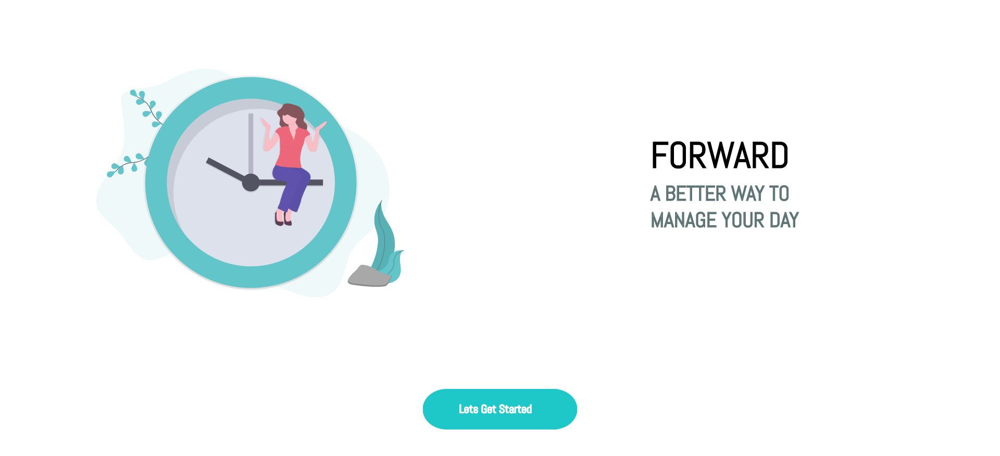
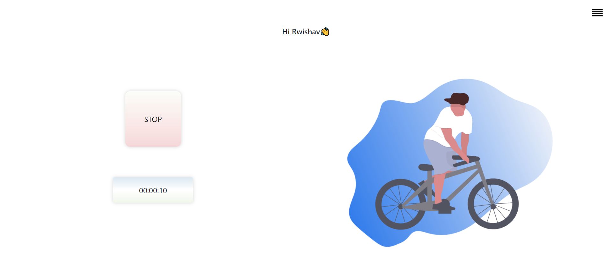
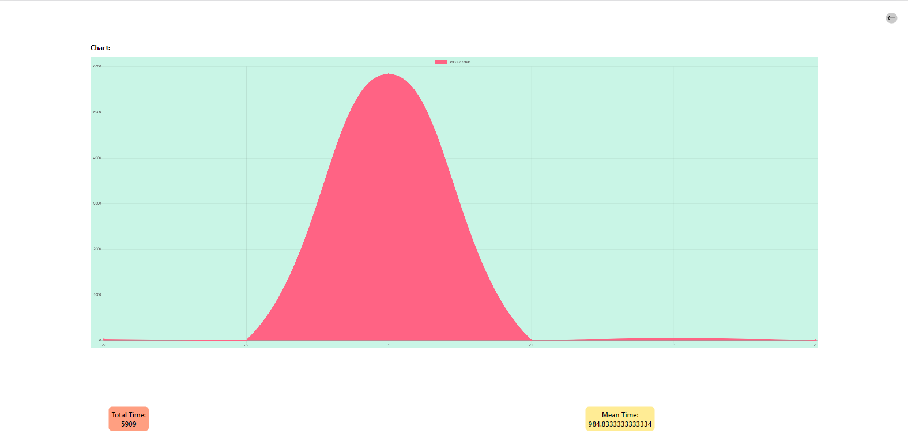

<!-- PROJECT LOGO -->
 

  <a href="https://forward-455dc.web.app/index.html">
    
    <h2 align="center">Forward</h2>
    <h3 align="center">A productivity App</h3>
    <h3 align="center">--------------------------</h3>
  </a>
  

    <a href="https://github.com/rwishavg/COVID-19-and-India/issues">Report Bug</a>
    ·
    <a href="https://github.com/rwishavg/COVID-19-and-India/issues">Request Feature</a>
  

<!-- ABOUT THE PROJECT -->
## About The Project

This project was born from a need for a software to track daily progress and time invested into work in general and solving DSA in specefic. In the hunt for a suitable application to fulfil our needs, we ended up building our own project. Forward keeps track of the time spent daily towards any activity and generates a graph based on collected data over time. It has a sign in feature and supports multiple concurrent users but is restricted to one device per user.

## Tech Stack

* [Google Firebase](https://firebase.google.com/)
* [HTML5, CSS3, Javascript](https://www.w3schools.com/html/html_scripts.asp)
* [Firestore](https://firebase.google.com/docs/firestore)
* [Chart.js](https://www.chartjs.org/)

It is built on vanilla js and html/css.

<!-- GETTING STARTED -->
## How to use

To try out the web-app simply follow the link : https://forward-455dc.web.app/index.html

## No Installation required

<!-- USAGE EXAMPLES -->

### Salient Features
1. Tracks time spent over a day at a certain activity persistently. 
2. Retains data even if browser is closed.
3. Generates a visualisation based on stored data over time.
4. Supports multiple concurrent users.
5. Easy to use. Deployed over the WEB. Accesible on mobile devices.

### What it Looks Like

<!-- LICENSE -->
## License

Distributed under the MIT License. See [LICENSE](https://github.com/rwishavg/Forward/blob/main/LICENSE) for more information.

<!-- CONTACT -->
## Contributors

[Rwishav Ghosh](https://rwishavg.github.io/portfolio/) 

[Samyak Mehta](https://github.com/1107-itssamyak)
